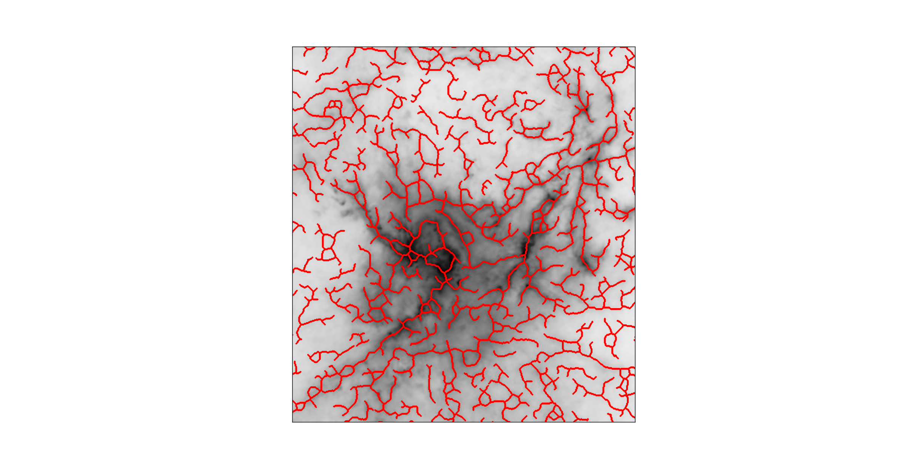

fil_finder
==========

See tutorial here! [fil_finder Tutorial](http://nbviewer.ipython.org/github/e-koch/fil_finder/blob/master/examples/fil_finder%20Tutorial.ipynb)

Brief Description
-----------------

fil_finder is a module for extraction and analysis of filamentary structure in molecular clouds. In particular, the algorithm is capable of uniformly extracting structure over a large dynamical range in intensity (see images below).

fil_finder segments filamentary structure in an integrated intensity image using adaptive thresholding.
Detected regions are reduced to a skeleton using a Medial Axis Transform.
Pixels within each skeleton are classified by the number of connecting pixels.
A pixel can be a body point, end point, or intersection point.
A shortest path algorithm, weighted by the intensity and length, finds the longest path through the skeleton, which is reported as the main length.
At this point, branches less than a length threshold are removed to give a final, cleaned skeleton.
A Euclidean Distance Transform is performed to build a radial profile of each filament.
A Gaussian with a constant background is fit to the profile to find the width.
The filament width is the FWHM value after deconvolving with the FWHM beamwidth of the instrument.
The curvature of the filament is described using the Rolling Hough Transform (Clark et al., 2013) is used.
This method returns the direction of the filament on the plane (median of the RHT) and the curvature (IQR of the RHT).

Example Images
--------------

Data shown below is from the Herschel Gould Belt Survey (Andre et al. 2010).

A close-up of the Chamaeleon I at 350 microns.

W3 and IC-1795 in the Aquila region also at 350 microns.

The same region with different color scaling to show faint features surrounding the complexes.

Southern region of Orion at 350 microns.

Package Dependencies
--------------------

Requires:

 *   numpy 1.7.1
 *   matplotlib
 *   astropy
 *   scipy
 *   scikits-image 0.8.0
 *   networkx

Optional:

 *  pygraphviz -- to make connectivity graphs (set verbose = True)
 *  prettyplotlib (https://github.com/olgabot/prettyplotlib)
