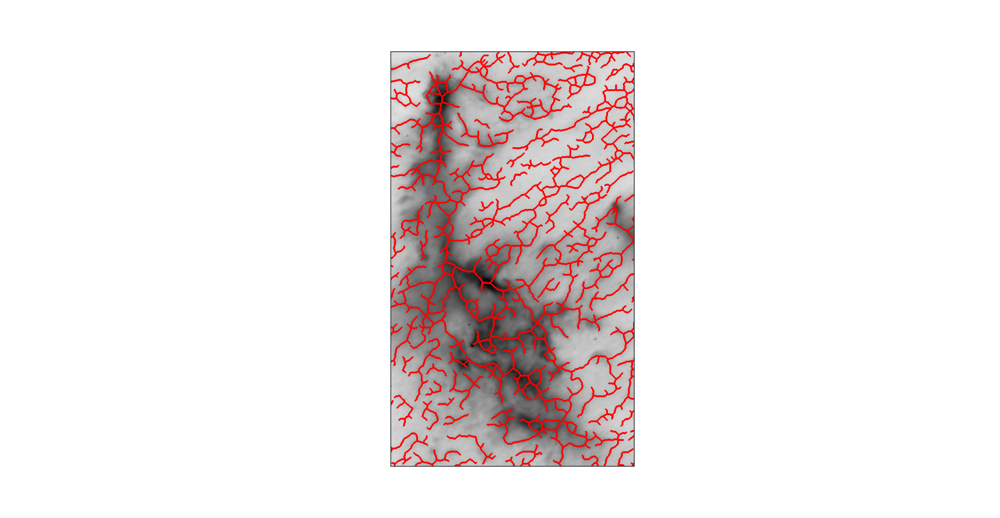
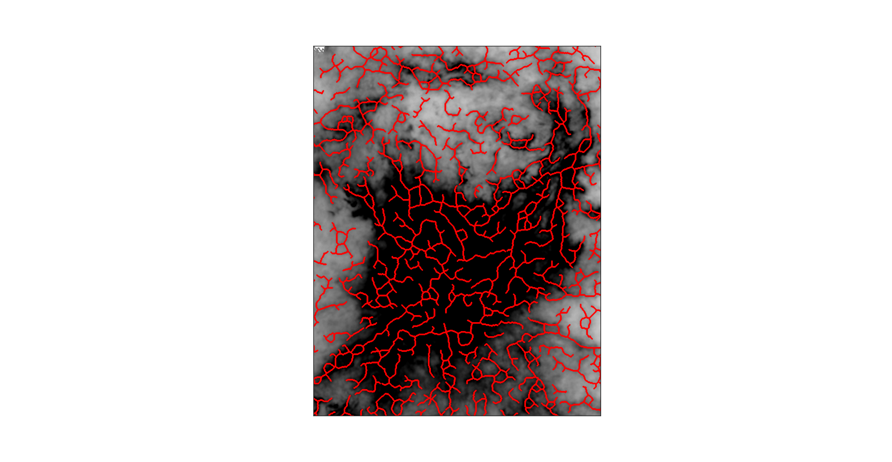
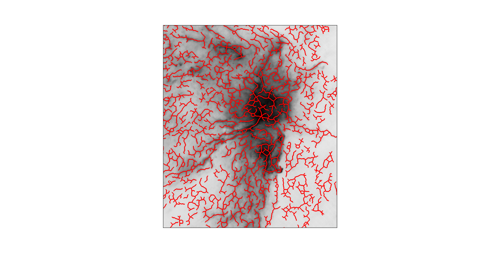

FilFinder
=========

[](http://dx.doi.org/10.5281/zenodo.18463)

[](https://readthedocs.org/projects/fil-finder/?badge=latest)

**See tutorial here! [fil_finder Tutorial](http://nbviewer.ipython.org/github/e-koch/FilFinder/blob/master/examples/fil_finder%20Tutorial.ipynb)**

**Check out our gallery page: [FilFinder Gallery](http://e-koch.github.io/FilFinder_Results/)**

Brief Description
-----------------

FilFinder is a Python package for extraction and analysis of filamentary structure in molecular clouds. In particular, the algorithm is capable of uniformly extracting structure over a large dynamical range in intensity (see images below).

The algorithm proceeds through multiple steps:

* FilFinder segments filamentary structure by using [adaptive thresholding](http://scikit-image.org/docs/dev/auto_examples/plot_threshold_adaptive.html). This performs thresholding over local neighborhoods, allowing for the extraction of structure over a large dynamic range.
* The final filament mask is constructed by applying morphological operators to remove extraneous small regions. The order of these operations are:
    * Flatten using an arctan transform - this removes the effects of small bright features (ie. cores) from effecting the filament mask.
    * Smooth with a small median filter (half the size of the expected filament widths) - this decreases fragmentation of regions in the final mask 
    * Apply the adaptive threshold - the patch size is set to the expected filament width (0.1 pc) by default - this sets the scale of the objects to be detected. Within a factor of a few, this size does not effect the result greatly. The widths of the masked regions are not used for deriving any physical properties.
    * Objects below a set area threshold are removed to give the final mask - For the HGBS data, we found a good threshold was $$\sim 5\times(0.1)^2$$ pc$$^2$$, but this may change depending on the data the algorithm is used on.
* The final regions are reduced to skeletons via a [Medial Axis Transform](http://scikit-image.org/docs/dev/auto_examples/plot_medial_transform.html) for further analysis.
* Pixels within each skeleton are classified by the number of connecting pixels. A pixel can be a body point, end point, or intersection point. The skeletons are broken up into a set of branches to determine the length.
* The length is determined by converting the set of branches into a graph. Nodes on the graph are intersections and end points. The branches make up the connections and their weighting in the graph is determined by their length and average intensity. A shortest path algorithm determines the longest path through the skeleton, which is reported as the main length.
* The skeletons are then pruned by removing branches that are: not in the main length, will not affect the connectivity of the entire graph if they are removed, and whose length and average intensity are below a set threshold. 
* The width of the filament is determined by building a radial profile using the distance from the skeleton. This is accomplished by using a Euclidean Distance Transform and binning the intensity values of the pixels based on their minimum distance from a skeleton pixel. By default, a Gaussian with a constant background is fit to the profile. A Lorentzian model and non-parametric model are also available in the package. The reported filament width is the FWHM after deconvolving with the the FWHM of the beam.
* A measure of filament direction and curvature is found using the [Rolling Hough Transform](http://adsabs.harvard.edu/abs/2014ApJ...789...82C). This method returns a distribution of angles, from which the mean and variance are  defined using circular statistics.

These are the basic steps of the algorithm, which will return the main filament properties: local amplitude and background, width, length, orientation and curvature. Additional tools are available, such as creating a filament-only image based on the properties of the radial fits.

The resulting mask and skeletons may be saved in FITS format. Property tables may be saved as a csv, fits or latex table. See the ```fil_finder_2D``` documentation for more details.


Contributing
------------

We welcome any user feedback on FilFinder's performance. If you find an issue with the code, or would like to request additional features, please raise an issue in the repository or send me an email at the address on [this page](https://github.com/e-koch).

We also welcome and encourage contributions to the code base! We want this package to evolve into a tool developed for the community, by the community.

Installation
------------

FilFinder can be installed via pip:

```
pip install FilFinder
```

To install from the repository, run:
```
python setup.py install
```

**NOTE:** Due to install conflicts amongst FilFinder's dependencies, installing the package will **NOT** install the dependencies. To check if you have the necessary packages installed, run:
```
python setup.py check_deps
```
Unfortunately, this is only available when installing from the repository.

Package Dependencies
--------------------

Requires:

 *   numpy 1.7.1
 *   matplotlib
 *   astropy
 *   scipy
 *   scikits-image 0.8.0
 *   networkx

Optional:

 *  prettyplotlib (https://github.com/olgabot/prettyplotlib) - *Will eventually be removed in a future release*

Example Images
--------------
**Want to see more results and examples? Check out our gallery page: [FilFinder Gallery](http://e-koch.github.io/FilFinder_Results/)**

Data shown below is from the Herschel Gould Belt Survey (Andre et al. 2010).

A close-up of the Chamaeleon I at 350 microns.



W3 and IC-1795 in the Aquila region also at 350 microns.


The same region with different color scaling to show faint features surrounding the complexes.



Southern region of Orion at 350 microns.


